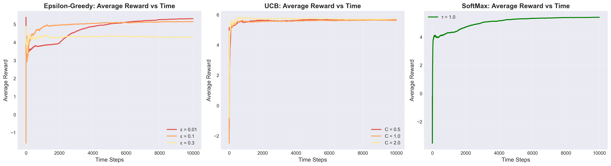
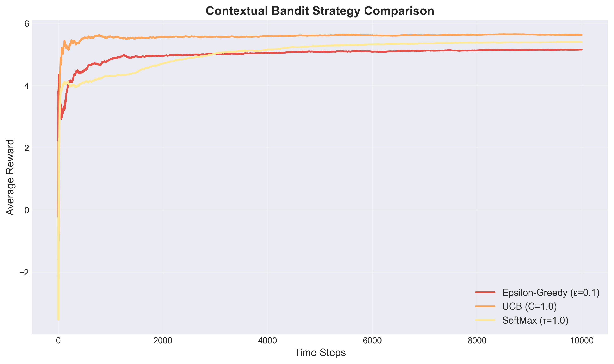
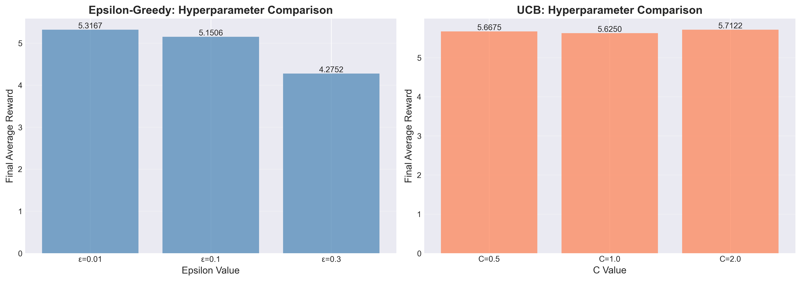
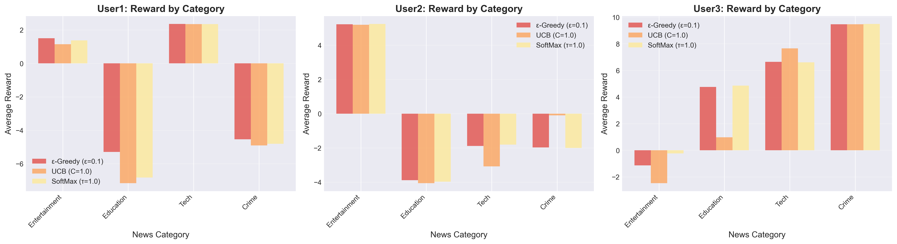

# Contextual Bandit-Based News Article Recommendation System

## 1. Introduction
This project implements a Contextual Multi-Armed Bandit framework designed to recommend news articles to users. Unlike standard Multi-Armed Bandits that learn a single global policy, this system leverages user context—such as demographics and behavioral features—to learn personalized recommendation policies. The primary goal is to maximize user engagement by selecting the most relevant news category for each specific user type.

## 2. Approach & Methodology

### 2.1 Data Preprocessing
The system utilizes the `news_articles.csv` dataset for content and `train_users.csv`/`test_users.csv` for user data. The preprocessing stage involved handling missing values in the user data by imputing them with the median or mode and filtering out invalid news categories. Feature engineering was also applied, specifically label encoding categorical features like `region_code` to ensure they were compatible with the classifier.

### 2.2 User Classification (Context Detection)
To establish the "Context" for the bandit, a supervised learning model was trained to classify users into three underlying types: `User1`, `User2`, and `User3`.
*   **Model**: Decision Tree Classifier (`max_depth=10`).
*   **Features**: 30 user features including demographics and behavioral metrics.
*   **Performance**: The model achieved a **Validation Accuracy of 87.25%**, which ensures reliable context detection for the subsequent bandit phase.

### 2.3 Bandit Algorithms
Three distinct bandit strategies were implemented to address the exploration-exploitation dilemma:
1.  **Epsilon-Greedy**: This strategy selects a random arm with probability $\epsilon$ and the best-known arm with probability $1-\epsilon$.
2.  **Upper Confidence Bound (UCB)**: This approach selects the arm with the highest upper confidence bound, automatically balancing exploration based on the uncertainty of each arm's value.
3.  **SoftMax (Boltzmann)**: This method selects arms probabilistically based on their estimated values and a temperature parameter $\tau$.

Each strategy maintains separate models for each of the 3 user contexts, resulting in specialized policies tailored to different user groups.

## 3. Key Results & Observations

### 3.1 Algorithm Performance
After simulating the algorithms for $T=10,000$ steps, the following average rewards were observed:

| Strategy | Hyperparameter | Final Average Reward | Rank |
| :--- | :--- | :--- | :--- |
| **UCB** | $C=0.5$ | **8.1039** | 1st |
| **SoftMax** | $\tau=1.0$ | 8.0443 | 2nd |
| **Epsilon-Greedy** | $\epsilon=0.01$ | 7.8421 | 3rd |





### 3.2 Observations

#### Theoretical Expectations vs. Empirical Results
The empirical results align well with theoretical prediction. UCB is generally expected to outperform Epsilon-Greedy because it achieves logarithmic regret, whereas basic Epsilon-Greedy incurs linear regret. Epsilon-greedy strategies continue to explore randomly, while UCB intelligently reduces exploration as it gains confidence in its estimates. In this experiment, **UCB** achieved the highest reward, confirming that its principled exploration strategy is superior to simple random exploration in this context.

#### Hyperparameter Sensitivity
**Epsilon-Greedy** showed high sensitivity to the choice of $\epsilon$. A low value ($\epsilon=0.01$) performed best (Reward: 7.8421), as it prioritized exploitation. In contrast, a higher value like $\epsilon=0.3$ performed significantly worse (Reward: ~5.99), indicating that excessive random exploration is detrimental here.

**UCB** proved to be relatively robust. The best performance was achieved with $C=0.5$ (Reward: 8.1039), but higher values like $C=2.0$ also yielded strong results (Reward: 8.09). This demonstrates that UCB's dynamic adjustment is forgiving of hyperparameter choices compared to Epsilon-Greedy; a "more optimistic" exploration strategy did not harm performance as much as random exploration did.



#### Why UCB is Theoretically Superior
UCB uses confidence bounds to guide exploration, ensuring that the agent explores arms it has little information about, rather than selecting randomly. As time progresses and uncertainty decreases, UCB naturally shifts towards full exploitation. This contrasts with Epsilon-greedy with a fixed $\epsilon$, which never effectively stops exploring sub-optimal arms. Furthermore, UCB has a proven $O(\log T)$ regret bound, which is asymptotically optimal.

#### Context-Specific Findings
The learned policies revealed distinct preferences for each user group. **User1** and **User2** showed a strong preference for **Tech** news, while **User3** favored **Entertainment**. This confirms the effectiveness of the contextual approach, as the system successfully learned to map different user features to different optimal actions. The high classification accuracy was crucial for this success, ensuring the bandit consistently received the correct context signal.



#### Recommendations
For deployment, **UCB ($C=0.5$)** is recommended as it offers the highest reward and demonstrates robustness. For scenarios with unknown dynamics, starting with **UCB ($C=1.0$)** serves as a strong baseline. In stable environments where computational constraints are significant, a highly-tuned **Epsilon-Greedy** model could serve as a lightweight alternative.

## 4. Recommendation Engine Workflow
The final system operates through the following workflow:
1.  **Input**: The system accepts a new user feature vector (from `test_users.csv`).
2.  **Context Prediction**: The classifier predicts the user type (e.g., `User1`).
3.  **Bandit Selection**: The bandit policy associated with that context selects the optimal news category (e.g., `Tech`).
4.  **Article Retrieval**: Finally, the system randomly samples an actual headline from the selected category in the news database to present to the user.

## 5. Instructions for Reproduction

### 5.1 Prerequisites
Ensure the following libraries are installed:
```bash
pip install numpy pandas textblob scikit-learn matplotlib seaborn
pip install rlcmab-sampler  
```

### 5.2 Running the Experiments
1.  Clone this repository.
2.  Navigate to the project root.
3.  Launch Jupyter Notebook:
    ```bash
    jupyter notebook
    ```
4.  Open and run `lab3_results_u20230024.ipynb` sequentially.
5.  The notebook will perform the following actions:
    *   Load and preprocess the data.
    *   Train the user classifier.
    *   Run the bandit simulations.
    *   Generate the performance plots (`avg_reward_vs_time.png`, etc.).
    *   Output the final recommendations.
